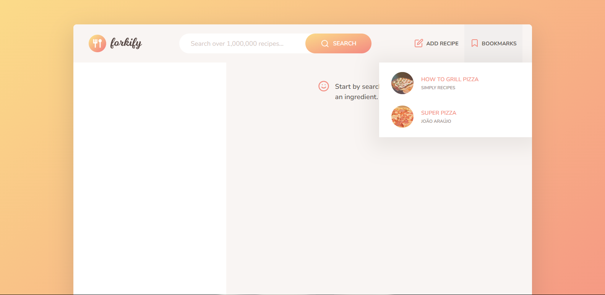

## RecipeApp
RecipeApp is a recipe management application, structured according to the MVC (Model-View-Controller) design pattern. The application allows users to search, view and manage cooking recipes in an interactive and intuitive way. The recipes are retrieved from a public API (https://forkify-api.herokuapp.com/v2), enabling users to explore a wide variety of culinary options. This project is a complete refactoring of Jonas Schmedtmann's 'Forkify' application obtained in the course of: The Complete JavaScript Course 2024: From Zero to Expert!

Technologies used:
- JavaScript
- CSS

### Menu - Home:

### Menu - Bookmarks:

### Menu - Add recipe:

### Menu - All recipes with the name 'pasta':

### Menu - Show recipe

